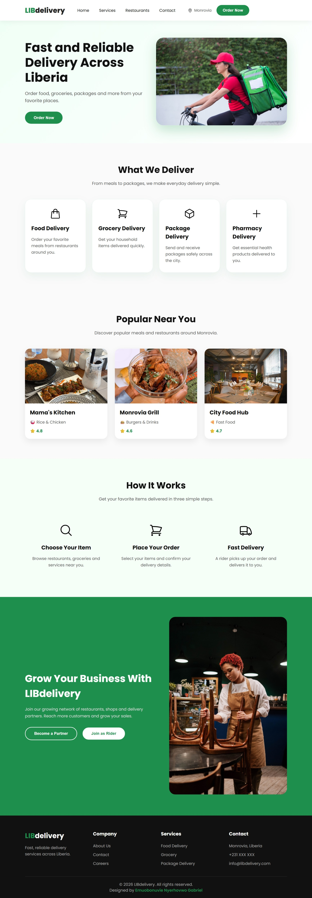

# 🚴 LIBdelivery - Fast Delivery Service Website



## 📌 About The Project

LIBdelivery is a modern delivery service landing page designed for Liberia.

The project showcases a clean and responsive user interface for a delivery platform where users can order food, groceries, packages, and other services.

This project was built as a frontend practice project to improve my skills in:

- HTML5
- CSS3
- Responsive Web Design
- JavaScript Interactions
- UI/UX Design Principles

The goal was to create a professional delivery website experience inspired by modern delivery platforms while giving it a unique Liberian identity.

---

## ✨ Features

✅ Responsive design for desktop, tablet, and mobile devices

✅ Modern navigation menu with mobile hamburger functionality

✅ Smooth scrolling between website sections

✅ Hero section with call-to-action buttons

✅ Delivery service cards

✅ Restaurant showcase section

✅ How It Works section

✅ Business partnership section

✅ Responsive footer with contact information

✅ Custom SVG icons and optimized images

---

## 🛠️ Technologies Used

- HTML5
- CSS3
- JavaScript
- SVG Icons
- Google Fonts

---

## 📂 Project Structure

```
LIBdelivery/

│
├── index.html
├── styles.css
├── script.js
│
└── Assets/

    ├── images/
    │
    └── icons/
```

---

## 🚀 Getting Started

To run this project locally:

### 1. Clone the repository

```bash
git clone git@github.com:iamrakki03-eng/LIBdelivery-Project.git
```

### 2. Open the project folder

```bash
cd LIBdelivery
```

### 3. Open the website

Open:

```
index.html
```

in your browser.

---

# 🤝 Contributing

Contributions are welcome! 

If you have ideas to improve the design, accessibility, performance, or add new features, feel free to contribute.

### How to contribute:

1. Fork this repository

2. Create your feature branch:

```bash
git checkout -b feature/AmazingFeature
```

3. Make your changes

4. Commit your changes:

```bash
git commit -m "Add AmazingFeature"
```

5. Push to your branch:

```bash
git push origin feature/AmazingFeature
```

6. Open a Pull Request

I will review your contribution and appreciate your effort in improving the project.

---

## 💡 Contribution Ideas

Some improvements you can help with:

- Add animations and transitions
- Improve accessibility
- Add more delivery categories
- Improve mobile responsiveness
- Add dark mode
- Connect with a backend API
- Add ordering functionality
- Improve SEO

---

## 🎨 Design Inspiration

This project was created to explore modern delivery website designs and demonstrate how a simple frontend project can be transformed into a professional user experience.


## 👨‍💻 Designer & Developer

Designed and developed by:

**Emuobonuvie Gabriel**

LinkedIn: https://www.linkedin.com/in/nyerhovwo-gabriel/


## 📄 License

This project is open-source and available for learning, improvement, and collaboration.

---

⭐ If you like this project, consider giving it a star.